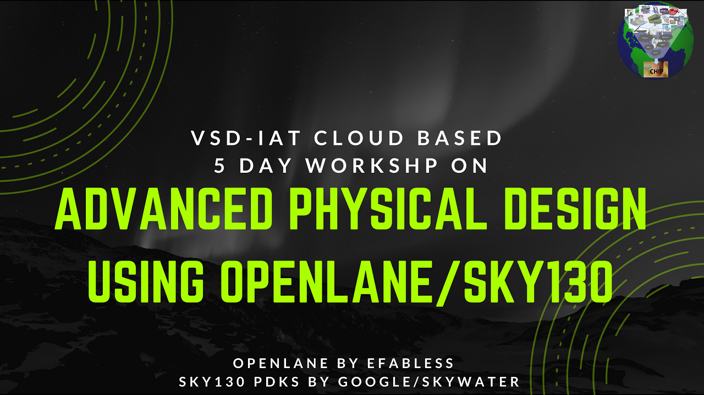

# adv-phy-design-openlane-sky130
## 5-day workshop on Advanced Physical Design using OpenLANE/Sky130

<!-- PROJECT LOGO -->
 

    

<!-- TABLE OF CONTENTS -->
 

  
Table of Contents

  <ol>
    <li>
      <a href="#about-the-workshop">About The Workshop</a>
    </li>
    <li>
      Day-1: Inception of open-source EDA, OpenLANE and Sky130 PDK
      <ul>
        <li><a href="day-1/d1_sk1_readme.md">SK1 - How to talk to computers</a></li>
        <li><a href="day-1/d1_sk2_readme.md">SK2 - SoC design and OpenLANE</a></li>
        <!-- <li><a href="#day-2">Day 2</a></li>
        <li><a href="#day-3">Day 3</a></li>
        <li><a href="#day-4">Day 4</a></li>
        <li><a href="#day-5">Day 5</a></li> -->
      </ul>
    </li>
    <li>
        <a href="#acknowledgements">Acknowledgements</a>
    </li>
  </ol>

 

<!-- ABOUT THE WORKSHOP -->
## About The Workshop

This project gives an interactive tutorial experied during the VSD Advanced Physical Design workshop using OpenLANE.

OpenLane is an automated RTL to GDSII flow based on several components including OpenROAD, Yosys, Magic, Netgen, CVC, SPEF-Extractor, KLayout and a number of custom scripts for design exploration and optimization. The flow performs all ASIC implementation steps from RTL all the way down to GDSII.

 

<!-- ## Day-1 - Inception of open-source EDA, OpenLANE and Sky130 PDK -->

## Acknowledgements

- [Nickson Jose - VSD VLSI Engineer](https://github.com/nickson-jose)
- [Kunal Ghosh - Co-founder (VSD Corp. Pvt. Ltd)](https://github.com/kunalg123)

