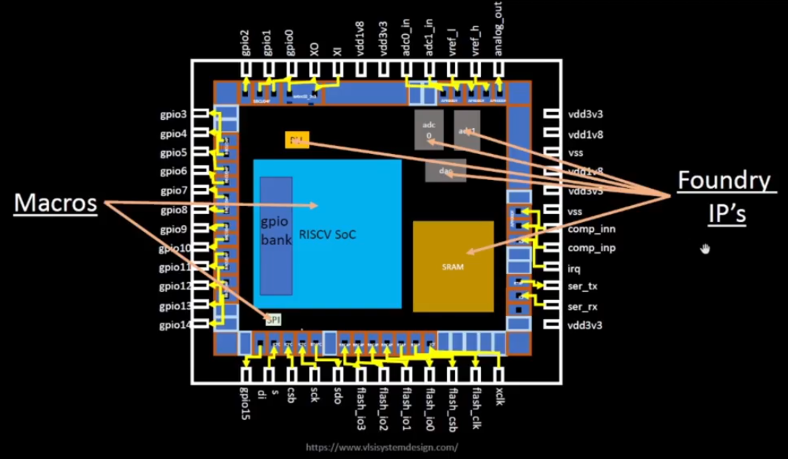
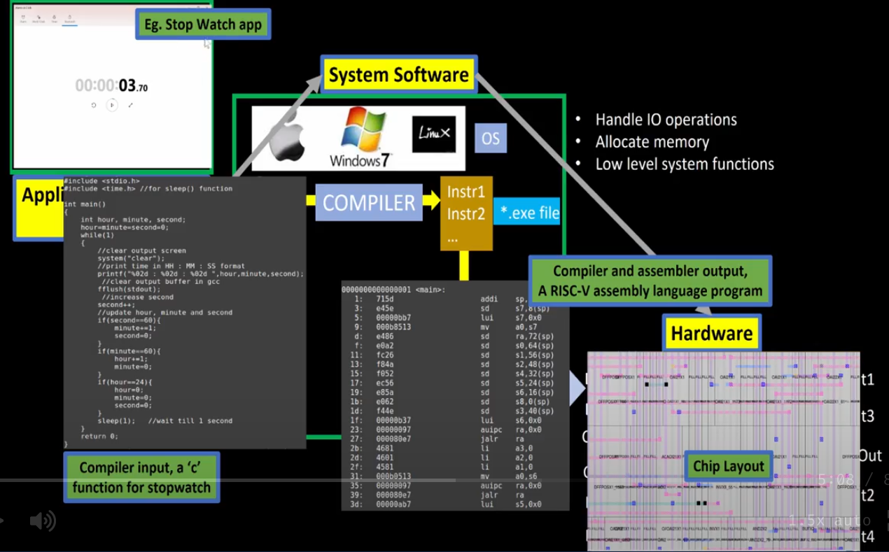
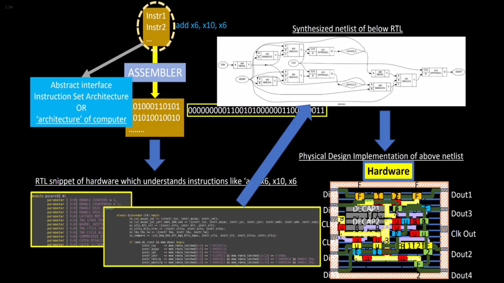

# Day-1: Inception of open-source EDA, OpenLANE and Sky130 PDK

## SKY130_D1_SK1 - How to talk to computers
 

- ### `SKY_L1` - Introduction to QFN-48, Package, chips, pads, core, die and IPs
    - `Package`: A package is a collection of wires that are connected to the pins of the chip. The package is the physical interface between the chip and the PCB.
    - `QFN-48`: `Quad Flat No-leads` package with 48 pins, an example of a package.
    - `Chip`: Chip sits at the center of the package. Chip is connected to the pins of the package via `wirebonds` that transfer signals from outside the package to the chip and vice-versa. A chip consists of various components:
        - `Pads`: Pads are the interface between the chip and the package. Signals go from inside the chip to outside and vice-versa through pads. They are the physical representation of the pins of the chip.
        - `Core`: It is surrounded by the pads. It is the physical representation of the design where all the digital logic is placed.
        - `Die`: It is the size of the chip which is manufactured on the silicon wafer.
    - A typical core consists of:
        - SoC such as RISC-V
        - SRAM
        - PLL
        - ADC
        - DAC
        - SPI
        - and other components
    - SRAM, PLL, ADC, DAC, SPI and other components are called `Foundry IPs`. Foundry is a place where we have machines to manufacture chips. Foundry IPs are the components that are manufactured by the foundry and are available for free to use.
    - `Macros`: These are the digital blocks.
    - For now, lets understand that Macros are pure digital blocks whereas IPs need some intelligence to build these building blocks, and hence the name.
    - If we want to manufacture a chip, we have to communicate with the Foundry via some interface. And the interface is the Foundry provides some files to us and through those files we can communicate with the Foundry. These files are called `Process Design Kit` or `PDK`.

     

    

    	 
    	Fig 1: Components inside a chip (source: SKY130_D1_SK1 > SKY_L1 video)
    

    
     
    
- ### `SKY_L2` - Introduction to RISC-V ISA, Instruction Set Architecture
    - `ISA`: ISA is the set of instructions that a processor can execute. In simple words, its the language of the computer through which we communicate with the computer.
    - For example if we want to run a C code on a layout which is the hardware in our computers, there's a certain flow to follow:
        - C program is first compiled to RISC-V assembly code.
        - Assembly code is then converted to machine code i.e. 0s and 1s that is understood by the computer.
        - Binary code or bits are then executed in the layout and er get the requried output.
    - Another interface that needs to be present between the RISC-V architecture and the layout is the `HDL (Hardware Description Language)`.
    - RISC-V ISA is a specification of the architecture of the processor. It is a specification that tells us what the processor should do. It is implemented using `RTL (Register Transfer Level)` code. RTL code is a HDL code that is used to implement the RISC-V ISA.
    - Then from RTL to layout is the standard `PnR` and `RTL2GDS` flow that we will learn in this workshop.

     

    

         
        Fig 2: C code to hardware layout (source: SKY130_D1_SK1 > SKY_L2 video)
    

    
     

- ### `SKY_L3` - From software applications to hardware
    - Question is how do the applications that we run on our computers get executed on the hardware or layout?
    - Applications first enter the block of `System Software` which converts the applications into binary language that is understood by the hardware.
    - System Software consists of major components:
        - `Operating System (OS)`: It handles things such as IO operations, allocates memory and low level system functions. Other job is to take the application code and convert it to assembly code and then into binary code.
        - `Compiler`: The functions provided by OS in various languages are taken by the respective compilers and converted into `.exe` file that have certain instructions. Syntax of these instructions depends on the hardware. For example, if the hardware belongs to Intel x86, the instructions will be in that format, similarly in case of ARM, MIPS and RISC-V. So, the compiler's job is to take the application code and convert it into the respective instructions for the given hardware.
        - `Assembler`: Once we have these instructions, the job of assembler is to convert these instructions into binary code.
        - This binary language is then fed to the hardware and hardware undertsands which function to execute based on the pattern in the binary code.
    - The instructions are an abstract interface between the C code and the hardware. This interface is called `ISA (Instruction Set Architecture)` or the `architecture of the computer`.
    - Now, a binary pattern for an `add` instruction is interpreted by the hardware using an interface i.e. RTL code. RTL code is a HDL snippet that `implements` the `specification` of add instruction or the complete RISC-V ISA.
    - This RTL is then synthesized to get the `netlist`. Netlist is synthesized or `gate-level` version of the specification. It is in the form of gates and flip-flops.
    - Finally the netlist converted into layout using the RTL2GDS flow.

     

    

         
        Fig 3: Software App to Hardware Layout flow (source: SKY130_D1_SK1 > SKY_L3 video)
    

    
     
    
    

         
        Fig 4: ISA to Hardware Layout flow (source: SKY130_D1_SK1 > SKY_L3 video)
    

    
     
