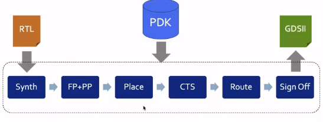
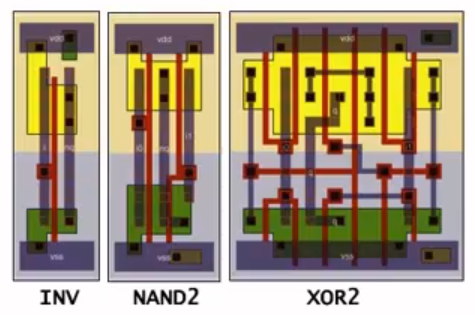
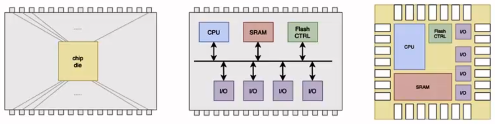
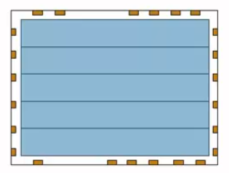
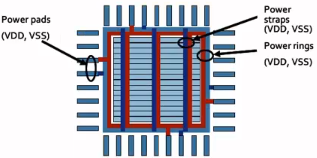
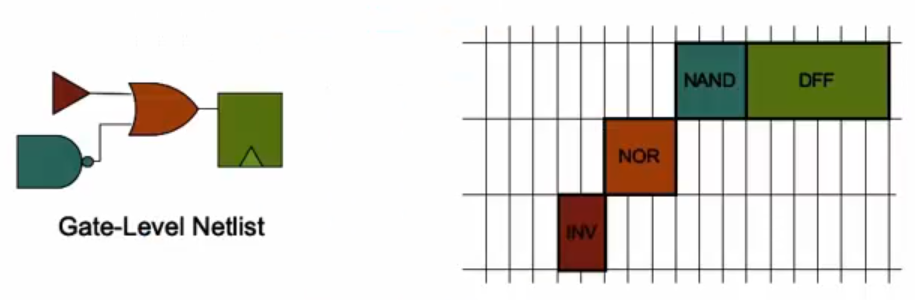
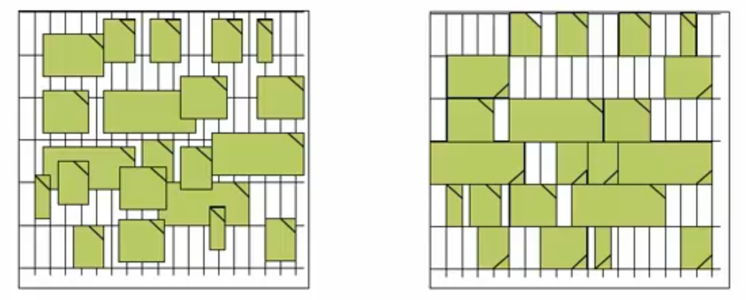
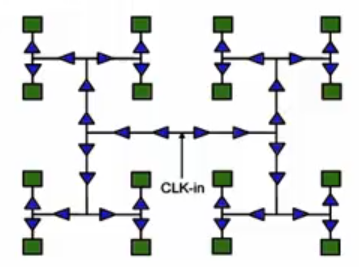
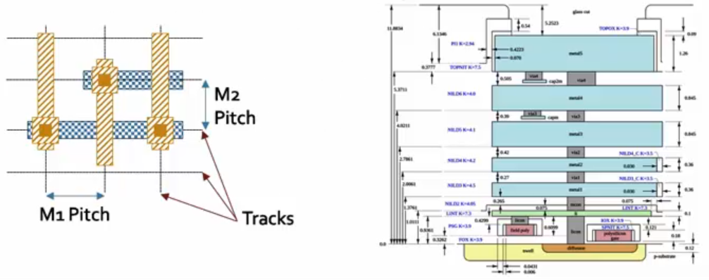

# Day-1: Inception of open-source EDA, OpenLANE and Sky130 PDK

## SKY130_D1_SK2 - SoC design and OpenLANE
 

- ### `SKY_L1` - Introduction to all components of open-source digital asic design
    - Designing Digital ASIC in an automated way requires certain elements (all of them must be present from day-1):
        - `RTL IPs`: HDLs that are used to implement the design. For example, RISC-V is an RTL IP.
        - `EDA Tools`: Tools for electronic design automation. For example, Yosys, OpenSTA, OpenROAD, etc.
        - `PDK Data`: It is a collection of files that are used to communicate with the foundry. For example, Skywater 130nm PDK.
    - For open-source digital ASIC design, we need open-source:
        - `RTL IPs`: available on librecores.org, opencores.org, github.com, etc.
        - `EDA Tools`: such as Spice simulator, Magic and nowadays Qflow, OpenLANE, OpenROAD, etc.
        - `PDK Data`: such as Skywater 130nm PDK.
    - What is `PDK`?
        - PDK is the interface between the FAB and the designers.
        - It is a collection of files used to model fabrication process for EDA tools used to design an IC.
            - Process Design Rules: DRC, LVS, PEX, etc.
            - Device Models: SPICE, Verilog, etc.
            - Digital Standard Cell Libraries: LEF, Liberty, etc.
            - IO Libraries: LEF, Liberty, etc.
            - Technology Files: SPEF, etc.
            - and many more.
        - Google released the first-ever PDK for 130nm node in 2020 to the masses with Skywater.
    - Is `130 nm` fast?
        - Yes it is, some examples are:
            - Intel Pentium IV @ 3.46 GHz
            - OSU's single-chip RV32I CPU @ 327 MHz, meaning pipelined version can achieve > 1 GHz clock.
    - ASIC design flow: piece of software that carries out the design process, from RTL to GDSII.
    
     

    

         
        Fig 1: ASIC Design Flow (source: SKY130_D1_SK2 > SKY_L1 video)
    

    
     
    
- ### `SKY_L2` - Simplified RTL2GDS flow
  
    1. `Synthesis`
        - Converts design RTL into a circuit made out of components from the `Standard Cell Library (SCL)`.
    
        - The resultant circuit is gate-level netlist which is functionally equivalent to the RTL code.
    
        - Standard cells have regular layout enclosed by fixed height (rectangular in shape) whereas the width is variable and is discrete i.e. integer multiple of unit cell side width.
    
           
          
          

               
              Fig 2: Synthesis step (source: SKY130_D1_SK2 > SKY_L2 video)
                
               
              Fig 3: Standard Cells layout (source: SKY130_D1_SK2 > SKY_L2 video)
          

          
           
    
    2. `Floor and Power Planning`
    
        - The objective here is to plan the silicon area and create the robust power distribution network to power the circuit.
    
        - `Chip Floorplanning`: chip die is partitioned into different blocks.
    
        - `Macro Floorplanning`: we define the macro dimensions, pin locations and rows and routing tracks which will be used later during the placement and routing steps.
    
             
    
            

                
                
                 
                Fig 4: Chip and Macro Floor Planning (source: SKY130_D1_SK2 > SKY_L2 video)
            

    
             
    
        - `Power Planning`
            
            - The power network is constructed.
            
            - Typically each chip is powered by multiple VDD and VSS (GND) pins.
            
            - The power pins are connected to all components through vertical rings and horizontal metal straps. Such parallel structures are meant to reduce resistance.
            
            - Typically the power distribution network is uses upper metal layers as they are thicker than the lower metal layers. Hence have less resistance.
            
               
            
              

                   
                  Fig 5: Power Planning (source: SKY130_D1_SK2 > SKY_L2 video)
              

            
               
    
    3. `Placement`
    
        - For macros we place the gate-level netlist cell on vertical rows.
    
        - To reduce the interconnect delay conical cells are placed very close to each other and this is also done to enable successful routing afterwards.
    
        - Placement is done in two steps:
    
          - `Global`: tries to find optimal positions for all cells, but its not necessary that all positions are legal, so cells may overlap or go off rows.
          - `Detailed`: here, the positions obtained from Global placement are minimally altered to be legal.
    
           
    
          

               
              Fig 6: Macro Placement Step (source: SKY130_D1_SK2 > SKY_L2 video)
                
               
              Fig 7: Global and Detailed Placement Steps (source: SKY130_D1_SK2 > SKY_L2 video)
          

    
           
    
    4. `Clock Tree Synthesis (CTS)`
    
        - After placement comes routing, but before routing the signals we need to route the clock by creating the clock distribution network that delivers clock to all the sequential blocks e.g. FFs.
    
        - Clock network looks like a tree where the clock source is at the root and the clocked elements are the end leaves.
    
        - This is done to deliver clock with minimum skew and minimum latency.
    
        - Clock skew means the arrival of clock to different components at different times.
    
        - It usually follows the shape such as H-tree, X-tree, etc.
    
           
    
          

               
              Fig 8: Clock Tree Synthesis step (source: SKY130_D1_SK2 > SKY_L2 video)
          

    
           
    
    5. `Routing`
    
        - After routing the clock comes signal routing.
    
        - Given the placement and fixed number of metal layers, its required to find a valid pattern for horizontal and vertical wires to implement the nets or interconnects which connect the cells together.
    
        - Router uses the available metal layers as defined by the PDK.
    
        - For each metal layer, PDK defines the thickness, minimum width, pitch and vias. Vias are used to connect wire segments on different metal layers.
    
        - The `SKY130 PDK` defines the `6` routing layers. The lowest layer is called the `local interconnect layer` which is titanium nitride layer. The following 5 layers are all aluminium layers.
    
        - Most routers are grid routers, they construct the routing grids out of the metal tracks.
    
        - As the routing grid is huge, they use the `Divide-and-Conquer` approach for routing.
    
        - First, `Global Routing` is performed using the coarse-grained grids to generate the routing guides.
    
        - Then, `Detailed Routing` uses the fine-grained grids and the routing grids to implement the actual wiring.
    
           
    
          

               
              Fig 9: Routing step (source: SKY130_D1_SK2 > SKY_L2 video)
          

    
           
    
    6. `Sign-Off`
    
        - Once done with routing, we can construct the final layout which undergoes verification. This includes:
          - <u>Physical Verification</u>
            - `Design Rule Checking (DRC)` - which ensures that final layout honours all design rules.
            - `Layout vs Schematic (LVS)` - makes sure that final layout matches the gate-level netlist that was started with.
          - <u>Timing Verification</u>
            - `Static Timining Analysis (STA)` - ensures that all timing constraints are met and the circuit will run at the designated clock frequency.
    
     
