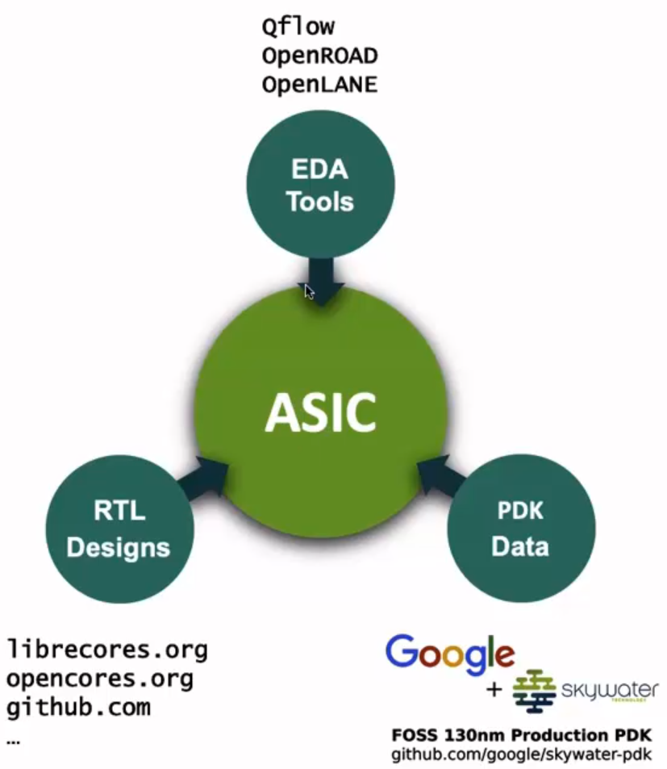

# Day-1: Inception of open-source EDA, OpenLane and Sky130 PDK

## SKY130_D1_SK2 - SoC design and OpenLane

 

### `SKY_L1` - Introduction to all components of open-source digital asic design

- Designing Digital ASIC in an automated way requires certain elements (all of them must be present from day-1):
	- `RTL IPs`: HDLs that are used to implement the design. For example, RISC-V is an RTL IP.
	- `EDA Tools`: Tools for electronic design automation. For example, Yosys, OpenSTA, OpenROAD, etc.
	- `PDK Data`: It is a collection of files that are used to communicate with the foundry. For example, Skywater 130nm PDK.

- For open-source digital ASIC design, we need open-source:
	- `RTL IPs`: available on librecores.org, opencores.org, github.com, etc.
	- `EDA Tools`: such as Spice simulator, Magic and nowadays Qflow, OpenLane, OpenROAD, etc.
	- `PDK Data`: such as Skywater 130nm PDK.

	 

	

		 
		Fig 1: Elements for Open Source ASIC Design (source: SKY130_D1_SK2 > SKY_L1 video)
	

	 

- What is `PDK`?
	- PDK is the interface between the FAB and the designers.
	- It is a collection of files used to model fabrication process for EDA tools used to design an IC.
		- Process Design Rules: DRC, LVS, PEX, etc.
		- Device Models: SPICE, Verilog, etc.
		- Digital Standard Cell Libraries: LEF, Liberty, etc.
		- IO Libraries: LEF, Liberty, etc.
		- Technology Files: SPEF, etc.
		- and many more.
	- Google released the first-ever PDK for 130nm node in 2020 to the masses with Skywater.

- Is `130 nm` fast?
	- Yes it is, some examples are:
		- Intel Pentium IV @ 3.46 GHz
		- OSU's single-chip RV32I CPU @ 327 MHz, meaning pipelined version can achieve > 1 GHz clock.

- ASIC design flow: piece of software that carries out the design process, from RTL to GDSII.

 

	 
	Fig 2: ASIC Design Flow (source: SKY130_D1_SK2 > SKY_L1 video)

 

### `SKY_L2` - Simplified RTL2GDS flow

1. #### `Synthesis`

	- Converts design RTL into a circuit made out of components from the `Standard Cell Library (SCL)`.

	- The resultant circuit is gate-level netlist which is functionally equivalent to the RTL code.

	- Standard cells have regular layout enclosed by fixed height (rectangular in shape) whereas the width is variable and is discrete i.e. integer multiple of unit cell side width.

	   

	  

		   
		  Fig 3: Synthesis step (source: SKY130_D1_SK2 > SKY_L2 video)
		    
		   
		  Fig 4: Standard Cells layout (source: SKY130_D1_SK2 > SKY_L2 video)
	  

	   

2. #### `Floor and Power Planning`

	- The objective here is to plan the silicon area and create the robust power distribution network to power the circuit.

	- ##### `Chip Floorplanning`: chip die is partitioned into different blocks.

	- ##### `Macro Floorplanning`: we define the macro dimensions, pin locations and rows and routing tracks which will be used later during the placement and routing steps.

		 

		

			
			
			 
			Fig 5: Chip and Macro Floor Planning (source: SKY130_D1_SK2 > SKY_L2 video)
		

		 

	- ##### `Power Planning`

		- The power network is constructed.

		- Typically each chip is powered by multiple VDD and VSS (GND) pins.

		- The power pins are connected to all components through vertical rings and horizontal metal straps. Such parallel structures are meant to reduce resistance.

		- Typically the power distribution network is uses upper metal layers as they are thicker than the lower metal layers. Hence have less resistance.

		   

		  

			   
			  Fig 6: Power Planning (source: SKY130_D1_SK2 > SKY_L2 video)
		  

		   

3. #### `Placement`

	- For macros we place the gate-level netlist cell on vertical rows.

	- To reduce the interconnect delay conical cells are placed very close to each other and this is also done to enable successful routing afterwards.

	- Placement is done in two steps:

	  - `Global`: tries to find optimal positions for all cells, but its not necessary that all positions are legal, so cells may overlap or go off rows.
	  - `Detailed`: here, the positions obtained from Global placement are minimally altered to be legal.

	   

	  

		   
		  Fig 7: Macro Placement Step (source: SKY130_D1_SK2 > SKY_L2 video)
		    
		   
		  Fig 8: Global and Detailed Placement Steps (source: SKY130_D1_SK2 > SKY_L2 video)
	  

	   

4. #### `Clock Tree Synthesis (CTS)`

	- After placement comes routing, but before routing the signals we need to route the clock by creating the clock distribution network that delivers clock to all the sequential blocks e.g. FFs.

	- Clock network looks like a tree where the clock source is at the root and the clocked elements are the end leaves.

	- This is done to deliver clock with minimum skew and minimum latency.

	- Clock skew means the arrival of clock to different components at different times.

	- It usually follows the shape such as H-tree, X-tree, etc.

	   

	  

		   
		  Fig 9: Clock Tree Synthesis step (source: SKY130_D1_SK2 > SKY_L2 video)
	  

	   

5. #### `Routing`

	- After routing the clock comes signal routing.

	- Given the placement and fixed number of metal layers, its required to find a valid pattern for horizontal and vertical wires to implement the nets or interconnects which connect the cells together.

	- Router uses the available metal layers as defined by the PDK.

	- For each metal layer, PDK defines the thickness, minimum width, pitch and vias. Vias are used to connect wire segments on different metal layers.

	- The `SKY130 PDK` defines the `6` routing layers. The lowest layer is called the `local interconnect layer` which is titanium nitride layer. The following 5 layers are all aluminium layers.

	- Most routers are grid routers, they construct the routing grids out of the metal tracks.

	- As the routing grid is huge, they use the `Divide-and-Conquer` approach for routing.

	- First, `Global Routing` is performed using the coarse-grained grids to generate the routing guides.

	- Then, `Detailed Routing` uses the fine-grained grids and the routing grids to implement the actual wiring.

	   

	  

		   
		  Fig 10: Routing step (source: SKY130_D1_SK2 > SKY_L2 video)
	  

	   

6. #### `Sign-Off`

	- Once done with routing, we can construct the final layout which undergoes verification. This includes:
	  - <h5><u>Physical Verification</u></h5>

		  - `Design Rule Checking (DRC)` - which ensures that final layout honours all design rules.
		  - `Layout vs Schematic (LVS)` - makes sure that final layout matches the gate-level netlist that was started with.
		- <h5><u>Timing Verification</u></h5>

		  - `Static Timining Analysis (STA)` - ensures that all timing constraints are met and the circuit will run at the designated clock frequency.

 

### `SKY_L3` - Introduction to OpenLane and Strive chipsets

- While using Open Source EDA tools, the problem is tougher.

- To develop an open source ASIC flow, one need to worry about:

  - Tools Qualification
  - Tools Calibration
  - Missing Tools

- With the release of open source PDK, [efabless](https://efabless.com/) decided to create a reference open source ASIC implementation methodology and flow.

- This flow is called [OpenLane](https://github.com/The-OpenROAD-Project/OpenLane).

- #### `OpenLane`

  - Main goal is to produce a clean `GDSII` with no human intervention (no-human-in-the-loop).
  - Clean means:
	- No LVS violations
	- No DRC violations
	- Timing violations? `WIP!`
  - It is tuned for `SkyWater 130 nm Open PDK`. It also works for `OSU 130 nm`.
  - Can be used to harden Macros and Chips, harden means one can use it to generate the final layout.
  - Two modes of operation:
	- `Autonomous`: like a push button flow, trigger it and it will generate the layout based on the design input in one go.
	- `Interactive`: we can run commands and steps one by one, so that we can see the intermediate results of each step.
  - It has a feature called `Design Space Exploration` which consists of best set of flow configurations. This provides a means to sweep through various configurations and find the best setting values for one's design.
  - It also has large number of design examples. Currently, 43 designs are available with their best configurations.

### `SKY_L4` - Introduction to OpenLane detailed ASIC design flow

- The below diagram shows the OpenLane ASIC flow:

   

  

	 
	Fig 11: OpenLane detailed ASIC design flow (source: SKY130_D1_SK2 > SKY_L4 video)
  

   

- It starts with design RTL and ends with the GDSII layout. To function, it needs the PDK.

- OpenLane is based on many open source projects like `OpenRoad`, `Magic`, `Fault`, `Yosys`, `ABC`, `Qflow`, etc.

- ASIC flow works as follows:

  - It starts with RTL synthesis. The RTL is fed to `Yosys` with the design constraints. Yosys translates the RTL into a logic circuit using generic components.
  
  - This circuit can be optimized and then mapped into cells from the standard cell library using the `ABC` tool. ABC has to be guided during the optimization. This guidance comes in the form of ABC script. OpenLane comes with several ABC scripts with different synthesis strategies targeting least area, best timing, etc. Different designs can use different strategies for achieving the objective.
  
  - For that, we have the `Synthesis Exploration Utility` that can be used to generate reports showing how the design's delay and area is affected by the synthesis strategy. And based on this exploration, we can select the best strategy to continue with.
  
  - Also, OpenLane has `Desing Exploration Utility` which can be used to sweep the design configurations (16 in total) and generates report which shows design matrix and also shows the number of violations after generating the final layout. This is very useful to find best configuration(s) for any given design. `NOTE`: It is recommended to explore the design first and then use the obtained design configuration. Design Exploration is also used for regression testing for continuous integration (CI). So we can use it to run the exploration using their best configurations and it will generate the report showing results comparing with the best known ones.
  
  - After synthesis comes the testing, so if you want your design to be ready for testing after fabrication, we can enable this step which is optional. And which uses the open-source project `Fault` to perform scan insertion, Automatic Test Pattern Generation (ATPG), Test Pattern Compaction, Fault Coverage and Fault Simulation.
  
  - Then comes the Physical Implementation which involves several steps and all of them are done by the [OpenROAD](https://theopenroadproject.org/) application. It is also called automated `PnR (Place and Route)` which consists of Floor/Power planning, End Decoupling Capacitors and Tap cells insertion, Global and Detailed placement, Post placement optimization, Clock Tree Synthesis (CTS), Global routing (using FastRoute). Then we use TritonRoute to perform Detailed routing.
  
  - Because we perform optimization that involves some transformations on the gate-level netlist generated by the synthesis step, we need to perform `Logic Equivalence Checking (LEC)` and this can be done using Yosys. We compare the netlist generated by the optimization during the physical implementation with the netlist generated during the synthesis to make sure they are functionally equivalent. And if they are not equivalent, eventually optimization did something wrong and what we ended up with is not what we started with.
  
  - During physical implementation, we have a special step and this step is `fake antenna diode insertion`. It is required to address the antenna rule violations. When a metal wire segment is fabricated and is long enough, it acts like an antenna. As an antenna, it collects charges which can damage the transistor gates connected to this wire during the fabrication. So the length of wire connected to transistor gate must be limited. Usually this is the job of a Router. If the router fails to do so, there are two solutions:
  
    - Bridging attaches a higher layer intermediary
    - Add antenna diode cell to leak away charges
  
    OpenLane takes preventive approach and adds a `Fake Antenna Diode` next to every cell input after placement. The Antenna Checker is run from the Magic tool against the routed layout. If the checker reports a violation on the cell input pin, we replace the fake diode cell by a real one. Fake Antenna Diode cell is created and added to standard cell library.
  
  - Signing-off involves Static Timing Analysis (STA), Design Rule Check (DRC) and Layout vs Schematic (LVS).
  
    - Timing sign-off involves interconnect RC extraction from the routed layout followed by STA using `OpenSTA`. Result of this step is a report highlighting timing violations, if any.
    - Physical sign-off involves DRC and LVS. DRC is performed using Magic tool. LVS involves using Magic for circuit extraction followed by `netgen` to perform the comparison.

 
