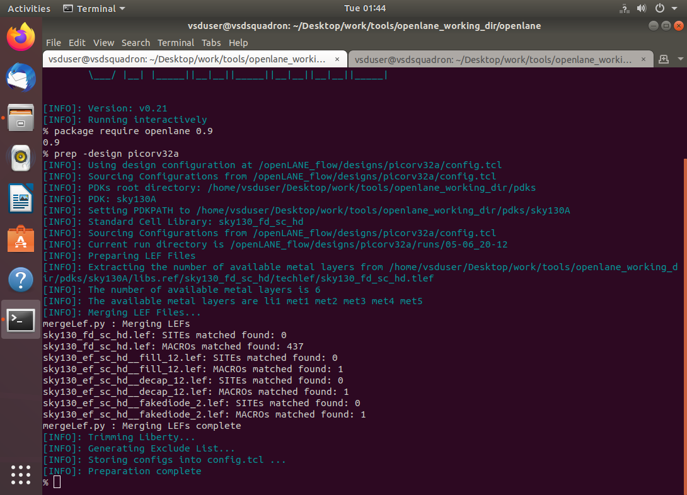

# Day-1: Inception of open-source EDA, OpenLane and Sky130 PDK

## SKY130_D1_SK3 - Get familiar to open-source EDA tools

<br />

### `SKY_L1` - OpenLane directory structure in detail

- OpenLane working directory consists of:
	
	- `pdks`
	
	  - This workshop uses Skywater 130 nm PDK.
	  - In this directory, you'll find: (a) `skywater-pdk` (b) `open_pdks` and (c) `sky130A`
	  - These are the folders containing all the PDK files i.e., the timing libraries, lef files, techlib and other information.
	  - The foundry files are basically compatible with the commercial EDA tools and not for open-source tools. So, open_pdk plans to mitigate this issue and are set of script files that make these foundry files compatible with the open-source EDA tools like magic, netgen, etc. sky130A is a PDK variant which is open-source.
	  - You'll find these folders in sky130A directory: (a) `libs.ref` and (b) `libs.tech`
	  - libs.ref contains all the process or technology specific files such as timing lib, cell lib, etc.
	    - We will be working on the `sky130_fd_sc_hd` files which states for Sky130 foundry std. cell. high definition.
	    - Under this directory, there are files such as:
	      1. `techlef` - contain layer information with extension of tlef
	      2. `lib` - contain timing files for respective temperature and voltage
	      3. `lef` - this is cell lef files with extension of lef
	
	
	  - libs.tech contains all the tool specific files such as for magic, netgen, qflow, ngspice, etc.
	

<br />

### `SKY_L2` - Design preparation step

<h4>Day-1 Lab</h4>

- OpenLane can be invoked using docker command using the interactive session.

- `flow.tcl` script inside OpenLane working directory specifies details for the OpenLane flow.

  #### `STEP 1`

- Start the OpenLane in interactive mode as follows and import required package:

  ```shell
  docker
  ./flow.tcl -interactive
  package require openlane 0.9
  ```

  **NOTE:** Above commands are to be run each time we use OpenLane for RTL2GDSII flow.

- OpenLane has multiple design files and we'll be working on `picorv32a` design. The contents of picorv32a directory are:

  - `src` - contains the verilog (.v) and design constraint (.sdc) files

  - `config.tcl` - bypasses any configuration that has been done i.e. many of the switches use default value that is already present in the OpenLane flow.

  - The precedence order of OpenLane settings are:

    `default_values` < `config.tcl` < `sky130A_sky130_fd_sc_hd_config.tcl`

- Contents of `config.tcl` are as below:

  ```shell
  less config.tcl
  ```

  ```shell
  # Design
  set ::env(DESIGN_NAME) "picorv32a"
  
  set ::env(VERILOG_FILES) "./designs/picorv32a/src/picorv32a.v"
  set ::env(SDC_FILE) "./designs/picorv32a/src/picorv32a.sdc"
  
  set ::env(CLOCK_PERIOD) "5.000"
  set ::env(CLOCK_PORT) "clk"
  
  set ::env(CLOCK_NET) $::env(CLOCK_PORT)
  
  set filename $::env(OPENLANE_ROOT)/designs/$::env(DESIGN_NAME)/$::env(PDK)_$::env(STD_CELL_LIBRARY)_config.tcl
  if { [file exists $filename] == 1} {
          source $filename
  }
  ```

  <br>

  #### `STEP 2`

- We will setup the design stage or file structure for the flow and to begin with synthesis of a design:

  ```shell
  prep -design picorv32a
  ```

  <br>

  <p align="center">
  	<br>
  	Fig 1: Design Preparation Step
  </p>

  <br>

  This creates the new directory named runs under picorv32a folder that consists of folder with name as datetime when the above command is run. It consists of results, reports, command logs, etc. as shown below.

  <p align="center">
  	<br>
  	Fig 2: Review file after Design Preparation Step
  </p>

<br />

### `SKY_L3` - Review files after design prep and run synthesis

- Below are the contents of the runs directory:

  ```shell
  picorv32a
  ├── config.tcl
  ├── sky130A_sky130_fd_sc_hd_config.tcl
  ├── runs
  │   ├── <tag>
  │   │   ├── config.tcl
  │   │   ├── {logs, reports, tmp}
  │   │   │   ├── cts
  │   │   │   ├── signoff
  │   │   │   ├── floorplan
  │   │   │   ├── placement
  │   │   │   ├── routing
  │   │   │   └── synthesis
  │   │   ├── results
  │   │   │   ├── final
  │   │   │   ├── cts
  │   │   │   ├── signoff
  │   │   │   ├── floorplan
  │   │   │   ├── placement
  │   │   │   ├── routing
  │   │   │   └── synthesis
  ```

  <br>

  #### `STEP 3`

- Run synthesis with the below command:

  ```shell
  run_synthesis
  ```

  <br>

- Yosys synthesis is run when the above command is entered. Along with it abc scripts are also run and OpenSTA is also run.

- After the synthesis step is complete, reports and results are generated.

- The  consists of:

  <p align="center">
  	<br>
  	Fig 3: Run Synthesis Step
  </p>

  <br>

- Also a synthesised netlist file is created in the results/synthesis directory named as `picorv32a.synthesis.v`.

<br />

### `SKY_L4` - OpenLane Project Git Link Description

OpenLane flow consists of several stages. By default all flow steps are run in sequence. Each stage may consist of multiple sub-stages.

1. `Synthesis`
   1. `yosys/abc` - Perform RTL synthesis and technology mapping.
   2. `OpenSTA` - Performs static timing analysis on the resulting netlist to generate timing reports
2. `Floorplaning`
   1. `init_fp` - Defines the core area for the macro as well as the rows (used for placement) and the tracks (used for routing)
   2. `ioplacer` - Places the macro input and output ports
   3. `pdngen` - Generates the power distribution network
   4. `tapcell` - Inserts welltap and decap cells in the floorplan
3. `Placement`
   1. `RePLace` - Performs global placement
   2. `Resizer` - Performs optional optimizations on the design
   3. `OpenDP` - Performs detailed placement to legalize the globally placed components
4. `CTS`
   1. `TritonCTS` - Synthesizes the clock distribution network (the clock tree)
5. `Routing`
   1. `FastRoute` - Performs global routing to generate a guide file for the detailed router
   2. `TritonRoute` - Performs detailed routing
   3. `OpenRCX` - Performs SPEF extraction
6. `Tapeout`
   1. `Magic` - Streams out the final GDSII layout file from the routed def
   2. `KLayout` - Streams out the final GDSII layout file from the routed def as a back-up
7. `Signoff`
   1. `Magic` - Performs DRC Checks & Antenna Checks
   2. `KLayout` - Performs DRC Checks
   3. `Netgen` - Performs LVS Checks
   4. `CVC` - Performs Circuit Validity Checks

<br>

OpenLane integrated several key open source tools over the execution stages:

|         **Task**         |                           Tool(s)                            |
| :----------------------: | :----------------------------------------------------------: |
|      RTL Synthesis       | [yosys](https://github.com/YosysHQ/yosys) + [abc](http://people.eecs.berkeley.edu/~alanmi/abc/) |
|  Static Timing Analysis  |  [OpenSTA](https://github.com/The-OpenROAD-Project/OpenSTA)  |
|      Floor Planning      | [init_fp](https://github.com/The-OpenROAD-Project/OpenROAD/tree/master/src/ifp), [ioPlacer](https://github.com/The-OpenROAD-Project/OpenROAD/tree/master/src/ppl), [pdn](https://github.com/The-OpenROAD-Project/OpenROAD/tree/master/src/pdn) and [tapcell](https://github.com/The-OpenROAD-Project/OpenROAD/tree/master/src/tap) |
|        Placement         | [RePLace](https://github.com/The-OpenROAD-Project/OpenROAD/tree/master/src/replace) (Global), [Resizer](https://github.com/The-OpenROAD-Project/OpenROAD/tree/master/src/rsz) and [OpenPhySyn](https://github.com/scale-lab/OpenPhySyn) (formerly), and [OpenDP](https://github.com/The-OpenROAD-Project/OpenROAD/tree/master/src/dpl) (Detailed) |
|   Clock Tree Synthesis   | [TritonCTS](https://github.com/The-OpenROAD-Project/OpenROAD/tree/master/src/cts) |
|      Fill Insertion      | [OpenDP/filler_placement](https://github.com/The-OpenROAD-Project/OpenROAD/tree/master/src/dpl) |
|         Routing          | [FastRoute](https://github.com/The-OpenROAD-Project/OpenROAD/tree/master/src/grt) or [CU-GR](https://github.com/cuhk-eda/cu-gr) (formerly) and [TritonRoute](https://github.com/The-OpenROAD-Project/OpenROAD/tree/master/src/TritonRoute) (Detailed) or [DR-CU](https://github.com/cuhk-eda/cu-gr) |
|     SPEF Extraction      | [OpenRCX](https://github.com/The-OpenROAD-Project/OpenROAD/tree/master/src/rcx) or [SPEF-Extractor](https://github.com/AUCOHL/spef-extractor) (formerly) |
|   GDSII Streaming out    | [Magic](https://github.com/RTimothyEdwards/magic) and [KLayout](https://github.com/KLayout/klayout) |
|        DRC Checks        | [Magic](https://github.com/RTimothyEdwards/magic) and [KLayout](https://github.com/KLayout/klayout) |
|        LVS check         |     [Netgen](https://github.com/RTimothyEdwards/netgen)      |
|      Antenna Checks      |      [Magic](https://github.com/RTimothyEdwards/magic)       |
| Circuit Validity Checker |           [CVC](https://github.com/d-m-bailey/cvc)           |

<br />

### `SKY_L5` - Steps to characterize synthesis results

#### Task 1: Find the D flip-flop ratio from synthesis report

- Output stats after the synthesis are as follows:

```shell
28. Printing statistics.

=== picorv32a ===

   Number of wires:              14596
   Number of wire bits:          14978
   Number of public wires:        1565
   Number of public wire bits:    1947
   Number of memories:               0
   Number of memory bits:            0
   Number of processes:              0
   Number of cells:              14876
     sky130_fd_sc_hd__a2111o_2       1
     sky130_fd_sc_hd__a211o_2       35
     sky130_fd_sc_hd__a211oi_2      60
     sky130_fd_sc_hd__a21bo_2      149
     sky130_fd_sc_hd__a21boi_2       8
     sky130_fd_sc_hd__a21o_2        57
     sky130_fd_sc_hd__a21oi_2      244
     sky130_fd_sc_hd__a221o_2       86
     sky130_fd_sc_hd__a22o_2      1013
     sky130_fd_sc_hd__a2bb2o_2    1748
     sky130_fd_sc_hd__a2bb2oi_2     81
     sky130_fd_sc_hd__a311o_2        2
     sky130_fd_sc_hd__a31o_2        49
     sky130_fd_sc_hd__a31oi_2        7
     sky130_fd_sc_hd__a32o_2        46
     sky130_fd_sc_hd__a41o_2         1
     sky130_fd_sc_hd__and2_2       157
     sky130_fd_sc_hd__and3_2        58
     sky130_fd_sc_hd__and4_2       345
     sky130_fd_sc_hd__and4b_2        1
     sky130_fd_sc_hd__buf_1       1656
     sky130_fd_sc_hd__buf_2          8
     sky130_fd_sc_hd__conb_1        42
     sky130_fd_sc_hd__dfxtp_2     1613
     sky130_fd_sc_hd__inv_2       1615
     sky130_fd_sc_hd__mux2_1      1224
     sky130_fd_sc_hd__mux2_2         2
     sky130_fd_sc_hd__mux4_1       221
     sky130_fd_sc_hd__nand2_2       78
     sky130_fd_sc_hd__nor2_2       524
     sky130_fd_sc_hd__nor2b_2        1
     sky130_fd_sc_hd__nor3_2        42
     sky130_fd_sc_hd__nor4_2         1
     sky130_fd_sc_hd__o2111a_2       2
     sky130_fd_sc_hd__o211a_2       69
     sky130_fd_sc_hd__o211ai_2       6
     sky130_fd_sc_hd__o21a_2        54
     sky130_fd_sc_hd__o21ai_2      141
     sky130_fd_sc_hd__o21ba_2      209
     sky130_fd_sc_hd__o21bai_2       1
     sky130_fd_sc_hd__o221a_2      204
     sky130_fd_sc_hd__o221ai_2       7
     sky130_fd_sc_hd__o22a_2      1312
     sky130_fd_sc_hd__o22ai_2       59
     sky130_fd_sc_hd__o2bb2a_2     119
     sky130_fd_sc_hd__o2bb2ai_2     92
     sky130_fd_sc_hd__o311a_2        8
     sky130_fd_sc_hd__o31a_2        19
     sky130_fd_sc_hd__o31ai_2        1
     sky130_fd_sc_hd__o32a_2       109
     sky130_fd_sc_hd__o41a_2         2
     sky130_fd_sc_hd__or2_2       1088
     sky130_fd_sc_hd__or2b_2        25
     sky130_fd_sc_hd__or3_2         68
     sky130_fd_sc_hd__or3b_2         5
     sky130_fd_sc_hd__or4_2         93
     sky130_fd_sc_hd__or4b_2         6
     sky130_fd_sc_hd__or4bb_2        2

   Chip area for module '\picorv32a': 147712.918400
```

- We can see here the DFF count: `sky130_fd_sc_hd__dfxtp_2` = `1613`

- And total number of cells = `14876`

  ```
  D flip-flop ratio 	= count of DFFs / total number of cells
  					= 1613 / 14876
  					= 0.108429685 (OR) 10.8429 %
  ```

- The `1-yosys_4.stat.rpt` file under `reports/synthesis` directory consists of the above stats.
- The `2-opensta.timing.rpt` file under `reports/synthesis` directory summarizes the timing report.

<br />
