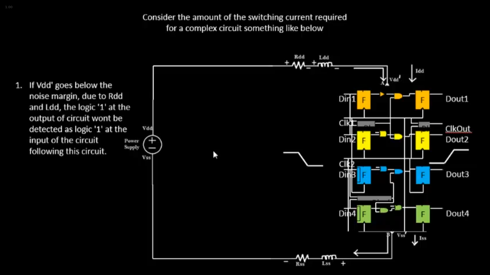

# Day-2: Good floorplan vs bad floorplan and introduction to library cellss

## SKY130_D2_SK1 - Chip Floor planning considerations

<br />

### `SKY_L1` - Utilization factor and aspect ratio

- Determining width and height of the core and die

  While defining the dimensions of the chip we are mostly dependent on the dimensions of the logic gates (standard cells) sitting in the netlist.

- `Core` is the section where fundamental logic is being placed whereas a `Die` is a small semiconductor material specimen on which the fundamental circuit is fabricated and it consists of a Core.

- Once the logic is placed in the Core, it utilizes certain amount of Core which is characterized by `Utilization Factor` which is defined as:

  ```shell
  Utilization Factor	= (Area occupied by the netlist) / (Total area of the Core)
  ```

  - If Utilization Factor = 1, it means 100% utilization and there is no room for extra cells to be added.
  - Therefore in practical scenario, the Core Utilization Factor is always less than 1.
  - We generally go with 50-60% utilization or utilization factor of 0.5-0.6.

- Another important consideration is `Aspect Ratio` which is defined as:

  ```shell
  Aspect Ratio	= (Height of the Core) / (Width of the Core)
  ```

  - If Aspect Ratio = 1, it means the Chip is square in nature.

<br />

### `SKY_L2` - Concept of pre-placed cells

- Generally the utilization factor is less than 1, hence we have some unused section of the Core.

- These unused sections are used for optimization and other things. In the unused section, we place additional cells, use it for routing, etc.

- `Pre-placed cells`

  - It is based on the concept of reusable modules or IPs. They are considered as some piece of a complex logic that will be used multiple times.

  - These blocks need not be implemented every time we need to use it, these blocks are functionally implemented sometime in the past i.e., only once (for e.g., memory, clock-gating, comparator, mux, etc.)

  - It is necessary to define the placement of these cells or IPs in a chip before routing.

  - These have fixed places on the Chip defined by the user.

  - Since these cells are placed before placement and routing, hence they are called Pre-placed cells. These are placed on the Core depending on the design scenario.

  - Automated placement and routing tools do not touch these cell positions.

    <p align="center">
    	<br>
    	Fig 1: Define locations of pre-placed cells (source: SKY130_D2_SK1 > SKY_L3 video)
    </p>

<br />

### `SKY_L3` - De-coupling capacitors

- The pre-placed cells need to be surrounded by de-coupling capacitors.

- Whenever there is a switching in a circuit there is certain amount of current required because basically there is small capacitor present at each node, so switching from 0 to 1 means the capacitor has to charge to represent logic 1 and the amount of charge is to be sent from the supply voltage.

- So it is responsibility of supply voltage VDD to supply the amount of current to the switching logic.

- Also while 1 to 0 switching it is the responsibility of VSS to take all the charge hence there is discharge current.

- Now due to wire resistance and inductance, there is a drop in the voltage across the wire during current flow.

- Due to the drop the voltage at node of switching logic becomes VDD' i.e. less than VDD (let's say VDD = 1 V then VDD' = 0.7 V).

- The VDD' (0.7 V) should be in our `noise margin` range for safe operation.

- But that's not the case always, hence to ensure safety we use de-coupling capacitors. These are huge capacitors filled with charge and the equivalent voltage across the capacitors are same as supply voltage (VDD).

- These capacitors de-couples the circuit from the main power supply whenever there is switching.

- So these capacitors have to provide the charge to each element demanding the current.

  <p align="center">
  	<br>
  	Fig 2: De-coupling caps (A) (source: SKY130_D2_SK1 > SKY_L3 video)
      <br>
      <br>
  	Fig 3: De-coupling caps (B) (source: SKY130_D2_SK1 > SKY_L3 video)
      <br>
      <br>
  	Fig 4: Noise Margin (source: SKY130_D2_SK1 > SKY_L3 video)
      <br>
      <br>
  	Fig 5: De-coupling caps (C) (source: SKY130_D2_SK1 > SKY_L3 video)
      <br>
      <br>
  	Fig 6: De-coupling caps (D) (source: SKY130_D2_SK1 > SKY_L3 video)
  </p>

<br />

### `SKY_L4` - Power planning

- There are a lot of macros on a chip and if each macro has its current demand so there will be need for lot of de-coupling capacitors which is not feasible.

- Therefore some critical blocks are decoupled using de-coupling caps but not for each element.

- Suppose there are 16 caps connected in parallel and half of them are switching from logic 1 to 0 i.e., all 8 caps are discharging to the same ground at the same time. Due to this, there is slight bump or increase in the ground potential which is called as `ground bounce` and if the bump size exceeds the noise margin then it might enter into undefined state.

- Similarly, suppose if 8 caps are switching from logic 0 to 1 i.e., all are charging to the same supply potential at the same time. Due to this, there is slight drop in the supply potential which is called `voltage droop` and again noise margin concept applies here too.

- This problem occurs because there is power supply available at one point of the Chip, instead if there is power supply at the entire periphery of the Chip then this problem is resolved. Hence solution to above problem is multiple power supply and ground ports around the Chip so that the macros charge from and discharge to the nearest supply lines.

  <p align="center">
  	<br>
  	Fig 7: Multiple VDD and VSS ports (source: SKY130_D2_SK1 > SKY_L4 video)
  </p>

<br />

### `SKY_L5` - Pin placement and logical cell placement blockage

- Netlist refers to the connectivity information between different gates coded using VHDL/Verilog language.

- These are pre-placed cores already present in the core. The area between the core and die are filled with the input and output ports.

- The I/O ports placement depends upon the cells connected to these ports as well as the pre-placed cells.

- The clock ports are wide in size as these are continuously driven pins and these drives the complete chip. So we need the least resistance path for the clocks, hence clock pins are wide.

  <br>

  <p align="center">
  	<br>
  	Fig 8: Pin placement step (source: SKY130_D2_SK1 > SKY_L5 video)
  </p>

  <br>

- After pin placement it should be made sure that the remaining empty area between the core and the die is blocked. Therefore `logical cell placement blockage` is done which ensures that automated placement and routing does not place anything in this area.

  <br>

  <p align="center">
  	<br>
  	Fig 9: Logical cell placement blockage (source: SKY130_D2_SK1 > SKY_L5 video)
  </p>

<br />

### `SKY_L6` - Steps to run floorplan using OpenLane

<br />
